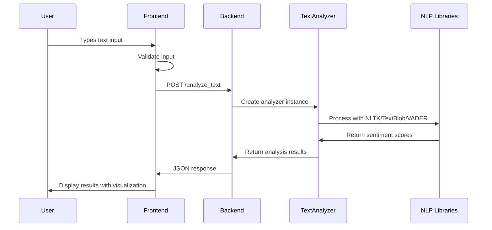
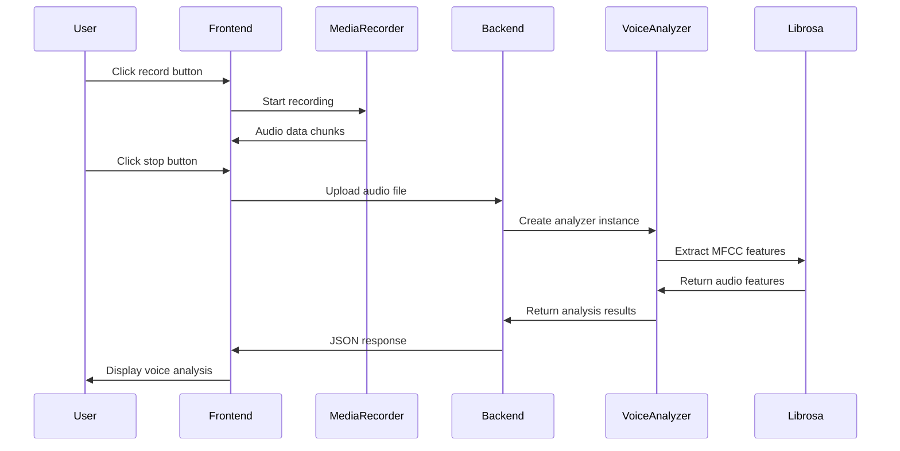

# 🏗️ System Architecture

## Mental Health Analyzer Architecture Overview

The Mental Health Analyzer follows a **3-tier architecture** with clear separation between presentation, business logic, and data processing layers.

## 🎯 Architecture Diagram

```
┌─────────────────────────────────────────────────────────────┐
│                    FRONTEND LAYER                           │
│  ┌─────────────┐  ┌─────────────┐  ┌─────────────────────┐  │
│  │    HTML5    │  │ JavaScript  │  │      CSS3           │  │
│  │             │  │   (ES6+)    │  │   (Bootstrap)       │  │
│  │ • Structure │  │ • UI Logic  │  │ • Styling           │  │
│  │ • Forms     │  │ • API Calls │  │ • Animations        │  │
│  │ • Media     │  │ • File Mgmt │  │ • Responsive        │  │
│  └─────────────┘  └─────────────┘  └─────────────────────┘  │
└─────────────────────────────────────────────────────────────┘
                             │
                    HTTP/AJAX Requests
                             │
┌─────────────────────────────────────────────────────────────┐
│                    BACKEND LAYER                            │
│  ┌─────────────────────────────────────────────────────────┐ │
│  │               Flask Web Server                          │ │
│  │  ┌─────────────┐ ┌─────────────┐ ┌─────────────────┐   │ │
│  │  │   Routes    │ │ Middleware  │ │   Error Handler │   │ │
│  │  │             │ │             │ │                 │   │ │
│  │  │ • /analyze_ │ │ • CORS      │ │ • Exception     │   │ │
│  │  │   text      │ │ • File Size │ │   Handling      │   │ │
│  │  │ • /analyze_ │ │ • Validation│ │ • Logging       │   │ │
│  │  │   voice     │ │ • Security  │ │ • Status Codes  │   │ │
│  │  │ • /analyze_ │ │             │ │                 │   │ │
│  │  │   facial    │ │             │ │                 │   │ │
│  │  └─────────────┘ └─────────────┘ └─────────────────┘   │ │
│  └─────────────────────────────────────────────────────────┘ │
└─────────────────────────────────────────────────────────────┘
                             │
                       Method Calls
                             │
┌─────────────────────────────────────────────────────────────┐
│                   ANALYSIS LAYER                            │
│  ┌─────────────┐  ┌─────────────┐  ┌─────────────────────┐  │
│  │    Text     │  │    Voice    │  │       Facial        │  │
│  │  Analysis   │  │  Analysis   │  │      Analysis       │  │
│  │             │  │             │  │                     │  │
│  │ • NLTK      │  │ • Librosa   │  │ • OpenCV            │  │
│  │ • TextBlob  │  │ • NumPy     │  │ • PIL               │  │
│  │ • VADER     │  │ • MFCC      │  │ • Haar Cascades     │  │
│  │ • Sentiment │  │ • Pitch     │  │ • Face Detection    │  │
│  └─────────────┘  └─────────────┘  └─────────────────────┘  │
└─────────────────────────────────────────────────────────────┘
                             │
                       File Processing
                             │
┌─────────────────────────────────────────────────────────────┐
│                    STORAGE LAYER                            │
│  ┌─────────────┐  ┌─────────────┐  ┌─────────────────────┐  │
│  │ Temporary   │  │   Config    │  │      Questions      │  │
│  │   Files     │  │    Data     │  │       Data          │  │
│  │             │  │             │  │                     │  │
│  │ • /tmp/     │  │ • ML Models │  │ • JSON Files        │  │
│  │ • Auto-     │  │ • Settings  │  │ • Templates         │  │
│  │   cleanup   │  │ • Constants │  │ • Static Data       │  │
│  └─────────────┘  └─────────────┘  └─────────────────────┘  │
└─────────────────────────────────────────────────────────────┘
```

## 🌐 Data Flow Architecture

### 1. User Interaction Flow
```
User Input → Frontend Validation → API Request → Backend Processing → Analysis → Response → UI Update
```

### 2. Text Analysis Flow


### 3. Voice Analysis Flow


## 🏛️ Component Architecture

### Frontend Components
```javascript
// Main Application Controller
class MindScopeAnalyzer {
    // Coordinates all frontend functionality
    
    // Sub-components:
    // - TabNavigator: Handles tab switching
    // - FormValidator: Validates user inputs  
    // - FileUploader: Manages file uploads
    // - ResultsRenderer: Displays analysis results
    // - VoiceRecorder: Audio recording interface
    // - ProgressTracker: Shows loading states
}

// Component Responsibilities:
┌─────────────────┐    ┌─────────────────┐    ┌─────────────────┐
│  TabNavigator   │    │  FormValidator  │    │  FileUploader   │
│                 │    │                 │    │                 │
│ • Tab switching │    │ • Input checks  │    │ • Drag & drop   │
│ • State mgmt    │    │ • Error display │    │ • File preview  │
│ • URL routing   │    │ • Sanitization  │    │ • Progress bars │
└─────────────────┘    └─────────────────┘    └─────────────────┘

┌─────────────────┐    ┌─────────────────┐    ┌─────────────────┐
│ ResultsRenderer │    │  VoiceRecorder  │    │ ProgressTracker │
│                 │    │                 │    │                 │
│ • Data viz      │    │ • Media API     │    │ • Loading states│
│ • Charts/graphs │    │ • Recording UI  │    │ • Error handling│
│ • Export data   │    │ • Audio preview │    │ • Status updates│
└─────────────────┘    └─────────────────┘    └─────────────────┘
```

### Backend Components
```python
# Flask Application Structure
app.py
├── Route Handlers (@app.route)
│   ├── analyze_text()
│   ├── analyze_voice()
│   ├── analyze_facial()
│   └── combined_analysis()
│
├── Middleware
│   ├── CORS configuration
│   ├── File upload limits
│   └── Error handling
│
└── Utility Functions
    ├── File management
    ├── Input validation
    └── Response formatting

# Analysis Module Structure  
analysis/
├── TextAnalyzer
│   ├── VADER sentiment
│   ├── TextBlob processing
│   ├── Mental health scoring
│   └── Keyword analysis
│
├── VoiceAnalyzer
│   ├── Audio loading
│   ├── MFCC extraction
│   ├── Pitch analysis
│   └── Emotion detection
│
└── FacialAnalyzer
    ├── Face detection
    ├── Expression analysis
    ├── Emotion classification
    └── Confidence scoring
```

## 🔄 Request/Response Patterns

### Standard API Request Pattern
```javascript
// Frontend Request Pattern
async function makeAnalysisRequest(endpoint, data, isFileUpload = false) {
    try {
        // 1. Show loading state
        showLoading();
        
        // 2. Prepare request
        const options = {
            method: 'POST',
            body: isFileUpload ? data : JSON.stringify(data)
        };
        
        if (!isFileUpload) {
            options.headers = { 'Content-Type': 'application/json' };
        }
        
        // 3. Make request
        const response = await fetch(endpoint, options);
        
        // 4. Handle response
        if (!response.ok) {
            throw new Error(`HTTP ${response.status}: ${response.statusText}`);
        }
        
        const results = await response.json();
        
        // 5. Process results
        return results;
        
    } catch (error) {
        // 6. Handle errors
        handleError(error);
        throw error;
    } finally {
        // 7. Hide loading state
        hideLoading();
    }
}
```

### Backend Response Pattern
```python
# Backend Response Pattern
@app.route('/analyze_text', methods=['POST'])
def analyze_text():
    try:
        # 1. Extract and validate input
        data = request.get_json()
        text = data.get('text', '').strip()
        
        if not text:
            return jsonify({'error': 'Text is required'}), 400
        
        # 2. Process input
        analyzer = TextAnalyzer()
        results = analyzer.analyze(text)
        
        # 3. Format response
        response_data = {
            'status': 'success',
            'data': results,
            'timestamp': datetime.utcnow().isoformat(),
            'processing_time': time.time() - start_time
        }
        
        # 4. Return JSON response
        return jsonify(response_data), 200
        
    except ValidationError as e:
        return jsonify({'error': str(e), 'type': 'validation'}), 400
    except ProcessingError as e:
        return jsonify({'error': str(e), 'type': 'processing'}), 500
    except Exception as e:
        logger.error(f"Unexpected error: {e}")
        return jsonify({'error': 'Internal server error'}), 500
```

## 🔐 Security Architecture

### Frontend Security
```javascript
// Input Sanitization
function sanitizeInput(text) {
    return text
        .replace(/[<>]/g, '') // Remove HTML tags
        .replace(/javascript:/gi, '') // Remove javascript: URLs
        .trim()
        .substring(0, 10000); // Limit length
}

// File Validation
function validateFile(file) {
    const allowedTypes = ['image/jpeg', 'image/png', 'audio/wav', 'audio/mp3'];
    const maxSize = 16 * 1024 * 1024; // 16MB
    
    return allowedTypes.includes(file.type) && file.size <= maxSize;
}
```

### Backend Security
```python
# Input validation and sanitization
def validate_text_input(text):
    if not isinstance(text, str):
        raise ValidationError("Text must be a string")
    
    if len(text) > 10000:
        raise ValidationError("Text too long")
    
    # Remove potentially harmful content
    cleaned_text = re.sub(r'[<>]', '', text)
    return cleaned_text.strip()

# File upload security
def secure_file_upload(file):
    # Check file extension
    allowed_extensions = {'.jpg', '.jpeg', '.png', '.wav', '.mp3'}
    file_ext = os.path.splitext(file.filename)[1].lower()
    
    if file_ext not in allowed_extensions:
        raise ValidationError("File type not allowed")
    
    # Check file size
    if file.content_length > 16 * 1024 * 1024:
        raise ValidationError("File too large")
    
    # Generate secure filename
    filename = f"{uuid.uuid4()}{file_ext}"
    return filename
```

## 📊 Performance Architecture

### Frontend Optimizations
```javascript
// Debounced input handling
function debounce(func, wait) {
    let timeout;
    return function executedFunction(...args) {
        const later = () => {
            clearTimeout(timeout);
            func(...args);
        };
        clearTimeout(timeout);
        timeout = setTimeout(later, wait);
    };
}

// Lazy loading of heavy components
async function loadAnalysisModule(type) {
    const modules = {
        'voice': () => import('./voice-analyzer.js'),
        'facial': () => import('./facial-analyzer.js')
    };
    
    return await modules[type]();
}

// Progressive enhancement
if ('mediaDevices' in navigator) {
    // Enable voice recording
    enableVoiceFeatures();
} else {
    // Show fallback message
    showVoiceNotSupported();
}
```

### Backend Optimizations
```python
# Caching expensive operations
from functools import lru_cache

@lru_cache(maxsize=100)
def load_ml_model(model_type):
    """Cache ML models to avoid reloading"""
    return joblib.load(f'models/{model_type}.pkl')

# Streaming file processing
def process_large_audio_file(file_path):
    """Process audio in chunks to manage memory"""
    chunk_size = 1024 * 1024  # 1MB chunks
    
    with open(file_path, 'rb') as f:
        while chunk := f.read(chunk_size):
            yield process_audio_chunk(chunk)

# Asynchronous processing
import asyncio

async def parallel_analysis(text, audio_path, image_path):
    """Run multiple analyses in parallel"""
    tasks = [
        asyncio.create_task(analyze_text_async(text)),
        asyncio.create_task(analyze_voice_async(audio_path)),
        asyncio.create_task(analyze_facial_async(image_path))
    ]
    
    results = await asyncio.gather(*tasks)
    return combine_results(results)
```

## 🔍 Monitoring and Logging

### Application Monitoring
```python
import logging
import time
from functools import wraps

# Performance monitoring decorator
def monitor_performance(func):
    @wraps(func)
    def wrapper(*args, **kwargs):
        start_time = time.time()
        try:
            result = func(*args, **kwargs)
            success = True
        except Exception as e:
            result = None
            success = False
            logger.error(f"Error in {func.__name__}: {e}")
            raise
        finally:
            duration = time.time() - start_time
            logger.info(f"{func.__name__}: {duration:.2f}s, Success: {success}")
        
        return result
    return wrapper

# Usage monitoring
@monitor_performance
def analyze_text(text):
    # Analysis logic
    pass
```

### Error Tracking
```javascript
// Frontend error tracking
window.addEventListener('error', (event) => {
    const errorData = {
        message: event.message,
        filename: event.filename,
        line: event.lineno,
        column: event.colno,
        stack: event.error?.stack,
        timestamp: new Date().toISOString(),
        userAgent: navigator.userAgent
    };
    
    // Send to backend for logging
    fetch('/log_error', {
        method: 'POST',
        headers: { 'Content-Type': 'application/json' },
        body: JSON.stringify(errorData)
    });
});
```

## 🚀 Deployment Architecture

### Development Environment
```
Local Development:
├── Flask Development Server (port 5000)
├── Documentation Server (port 8000)  
├── Live Reload for Frontend
└── Debug Mode Enabled
```

### Production Considerations
```
Production Environment:
├── WSGI Server (Gunicorn/uWSGI)
├── Reverse Proxy (Nginx)
├── Load Balancing
├── SSL/TLS Encryption
├── Static File Serving
├── Logging and Monitoring
└── Error Tracking
```

**Key Architecture Benefits:**
- 🔄 **Separation of Concerns**: Clear layer boundaries
- 📈 **Scalability**: Modular components can be scaled independently
- 🔧 **Maintainability**: Well-organized code structure
- 🛡️ **Security**: Multiple validation layers
- 🎯 **Performance**: Optimized for fast response times
- 📱 **Responsive**: Works across devices and browsers

**Next Steps:**
- 💻 Review [Backend Logic](backend-logic) for implementation details
- 🎨 Check [Frontend Logic](frontend-logic) for UI component architecture
- 🔌 Study [API Overview](api-overview) for data flow patterns 